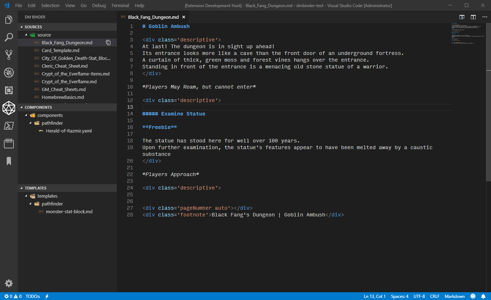

# vscode-dmbinder

Visual Studio Code extension for managing campaign documents.

## Features

- Generation of Hombrewery elements using snippets and pandoc templating

## Requirements

- [Pandoc](https://pandoc.org) >= 2.3

## Usage
In order to render files to PDF, you'll need to do one of the following:
- Point to a local Chrome installation by using `dmbinder.config.chooseChromePath`
- Set `dmbinder.chromeExecutablePath` to point an existing Chrome executable
- Download a version of Chromium by using `dmbinder.config.downloadChromiumRevision`

For best results when using `dmbinder.config.downloadChromiumRevision` to download Chromium instance for PDF rendering,
it is recommended to use the suggested revision or later.

<details open>
<summary>DMBinder Explorer</summary>

The extension looks for `.dmbinder/campaign.json` in your workspace folders, and displays all DMBinder campaigns in the sidebar.



</details>

## campaign.json
Below is an example Campaign configuration file:
``` json
{
    "campaignName": "My Cool Campaign",
    "sourcePaths": [
        "./source/"
    ],
    "templatePaths": [
        "./templates/"
    ],
    "componentPaths": [
        "./components/"
    ],
    "outDirectory": "./out/"
}
```

See [generator-dmbinder](https://github.com/jsnee/generator-dmbinder) for a yeoman generator to help bootstrap a campaign binder.

See [Changelog](CHANGELOG.md) for release notes.

-----------------------------------------------------------------------------------------------------------

## Icon Sources
- [Material Design Icons](https://materialdesignicons.com/)
- Official icons (various icons from Microsoft's vscode repo)

## Related Projects
- [Homebrewery](https://github.com/naturalcrit/homebrewery)
- [homebrewery-vscode](https://github.com/OfficerHalf/homebrewery-vscode)